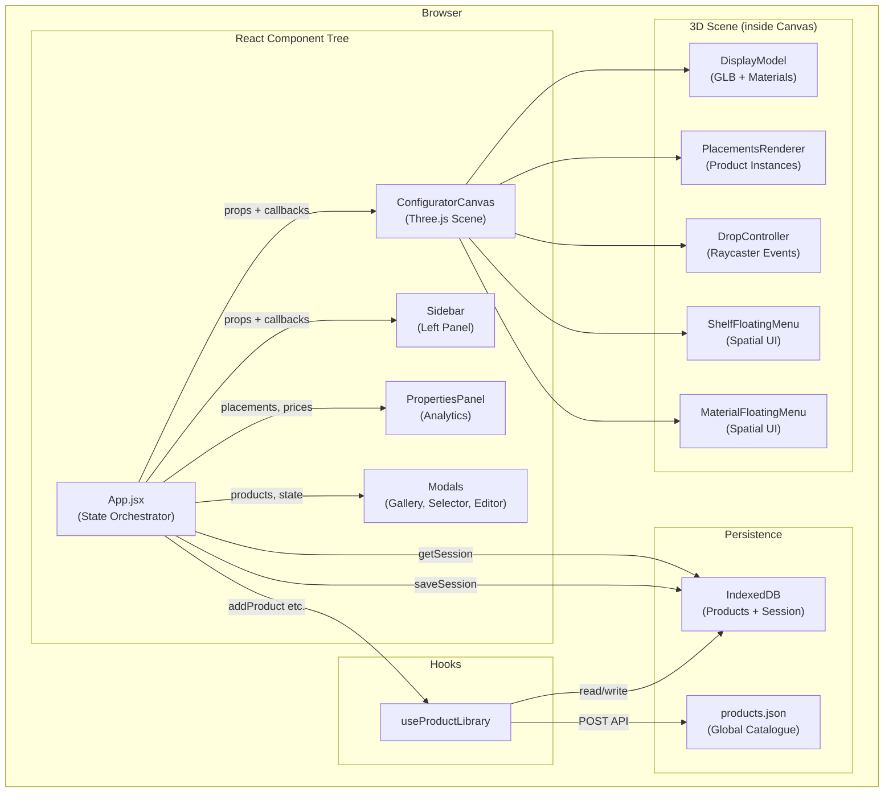
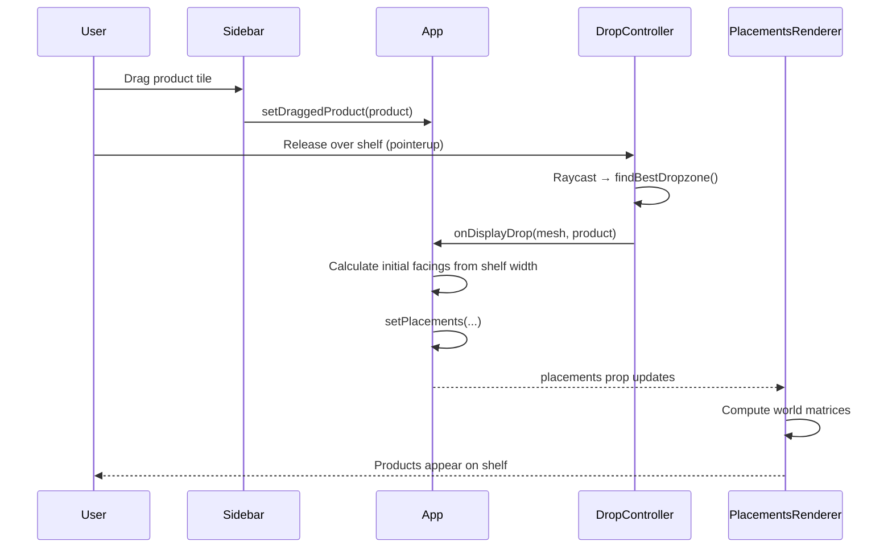
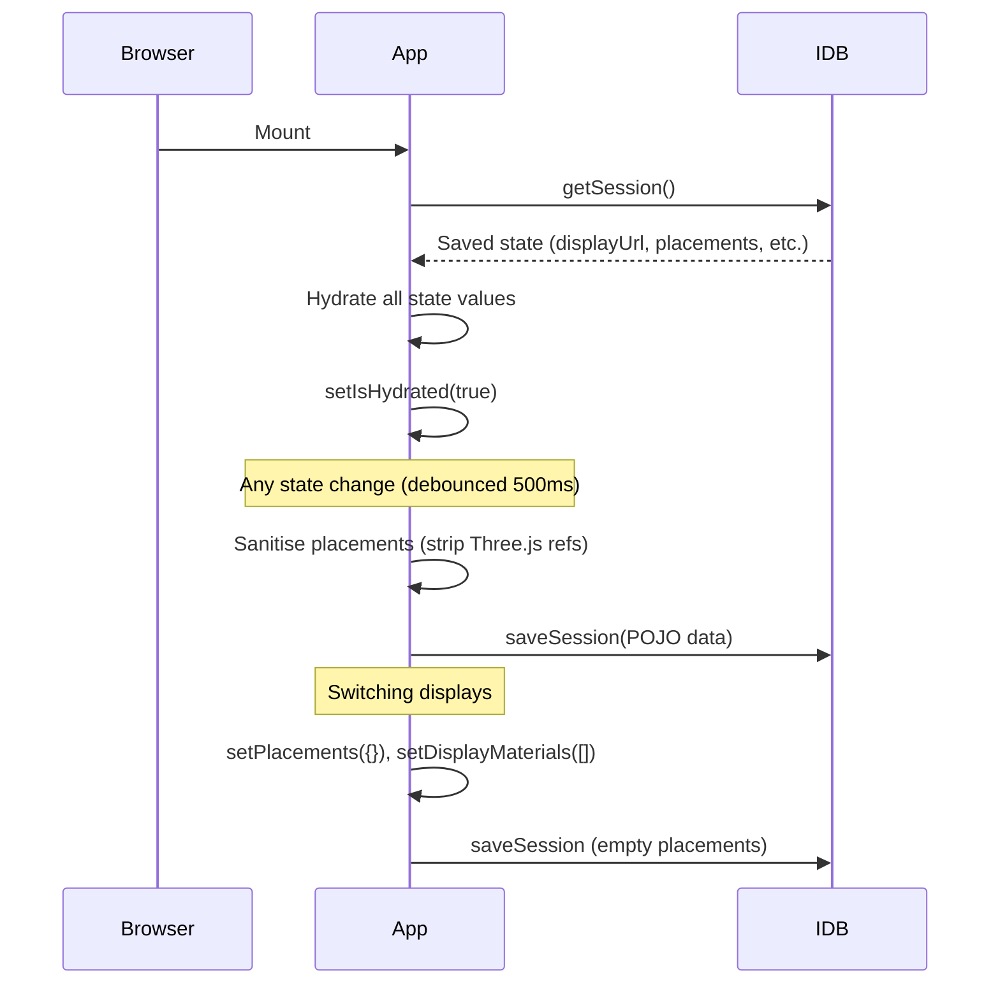
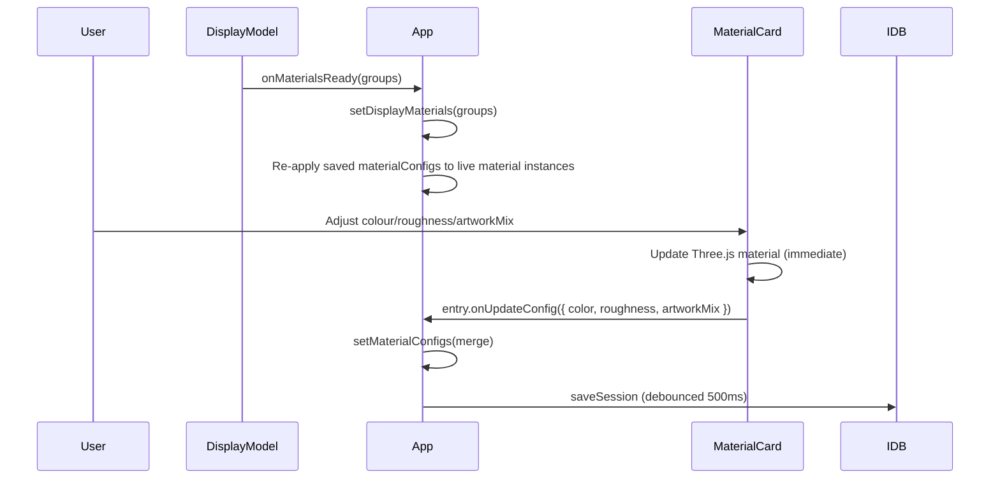

# Packout Web — Code Review & Architecture Report

> Generated: April 2026  
> Reviewer: Claude Code (Sonnet 4.6)

---

## 1. What the App Does

**Packout** is a browser-based 3D retail fixture configurator. Users:

1. Choose a display fixture (corrugated cardboard stand, floorstand, etc.)
2. Drag products from a managed library onto virtual shelves
3. Edit display materials (colour, roughness, artwork mix)
4. View profitability analytics in real time
5. Export a PNG screenshot or launch the display in native iOS AR Quick Look (USDZ)

---

## 2. Tech Stack

| Layer | Technology |
|---|---|
| UI framework | React 19 (hooks-only, no class components) |
| Build tool | Vite 8 + `@vitejs/plugin-react` |
| Styling | Tailwind CSS 4 (utility classes + CSS custom properties) |
| 3D engine | Three.js 0.182 |
| React/Three.js bridge | `@react-three/fiber` 9 + `@react-three/drei` 10 |
| Local persistence | IndexedDB via `idb` 8 |
| AR export | Three.js `USDZExporter` → iOS AR Quick Look |
| Spreadsheet import | `xlsx` 0.18 |
| Icons | `lucide-react` |
| Deployment target | GitHub Pages (`/packout-web/` base path) |

---

## 3. Directory Structure

```
packout-web/
├── public/
│   ├── displays/           GLB fixture models + auto-generated manifest.json
│   ├── previews/           PNG thumbnail images for the display selector
│   ├── products/           Uploaded product textures (PNG) and models (GLB)
│   ├── studios/            HDR environment maps (.exr)
│   └── data/
│       └── products.json   Global product catalogue (written by Vite middleware)
│
└── src/
    ├── App.jsx             Root — all shared state, orchestration
    ├── ConfiguratorCanvas.jsx  Three.js Canvas + scene management
    ├── main.jsx            React DOM entry point
    ├── App.css / index.css Global styles + Tailwind theme variables
    │
    ├── components/
    │   ├── DisplayModel.jsx        GLB loader, material classification
    │   ├── PlacementsRenderer.jsx  Product instance rendering
    │   ├── DropController.jsx      Raycaster-based pointer/drop events
    │   ├── ShelfFloatingMenu.jsx   Spatial shelf-edit panel (3D-anchored)
    │   ├── MaterialFloatingMenu.jsx Spatial material-edit panel (3D-anchored)
    │   ├── MaterialEditor.jsx      Sidebar material editor UI
    │   ├── Sidebar.jsx             Left panel (display, bin, export)
    │   ├── PropertiesPanel.jsx     Bottom-right profitability report
    │   ├── ProductGalleryModal.jsx Full-screen product library
    │   ├── CustomProductCreator.jsx Create/edit custom product form
    │   ├── DisplaySelectorModal.jsx Fixture picker modal
    │   ├── ProductThumbnail.jsx    2D image or 3D canvas thumbnail
    │   ├── LazyThumbnail.jsx       IntersectionObserver lazy-load wrapper
    │   └── EditProductSection.jsx  Inline shelf editor (legacy/unused)
    │
    ├── hooks/
    │   └── useProductLibrary.js   Product CRUD + dual persistence
    │
    └── utils/
        ├── ARUtility.js       USDZ generation + iOS AR launch
        ├── idbUtility.js      IndexedDB abstraction (Products + Session stores)
        ├── textureUtils.js    Canvas-based artwork mix blending
        └── excelParser.js     Excel → product stubs + image fuzzy-matching
```

---

## 4. Application Architecture

### 4.1 Layer Diagram



### 4.2 State Ownership

All shared application state lives in `App.jsx`. There is no external state manager (Redux, Zustand, etc.) — this is intentional for a single-user, single-page tool.

| State | Type | Description |
|---|---|---|
| `displayUrl` | `string` | URL of the active GLB fixture |
| `placements` | `{ [meshName]: { items[] } }` | All products on all shelves |
| `stagedProductIds` | `string[]` | Products in the bin |
| `materialConfigs` | `{ [group]: { [uuid]: overrides } }` | POJO material overrides |
| `displayMaterials` | `MaterialGroup[]` | Live material registry from DisplayModel |
| `displayRotation` | `number` | Y-axis rotation in degrees |
| `unitPrices` / `unitCosts` | `{ [id]: number }` | Per-product pricing |
| `arStatus` | `'idle'\|'generating'\|'ready'` | AR export phase |

### 4.3 Data Flow: Product Drop



### 4.4 Data Flow: Session Persistence



### 4.5 Data Flow: Material Editing



---

## 5. Key Design Decisions

### 5.1 Stable Mesh Names as Map Keys
Product placements and material configs are keyed by the GLB mesh's **name** string (e.g. `"shelf_left"`), not by a transient UUID. This means:
- Placements survive model reloads and IDB round-trips
- Re-binding after hydration is a simple `getObjectByName()` call
- Changing the GLB mesh names in Blender would break saved sessions

### 5.2 POJO Sanitisation Before IDB
Three.js `Object3D` and `Material` instances cannot be serialised by the structured clone algorithm. Before every `saveSession` write, `App.jsx` strips any accidental object references from the placements map, keeping only plain JS values. Material configs are stored as `{ color, roughness, artworkMix }` POJOs only.

### 5.3 Callback Refs in DropController
All event handlers in `DropController` are registered once (inside a single `useEffect`) and read prop values through refs. This avoids re-registering DOM listeners on every prop change while keeping the handlers always current.

### 5.4 Two-Phase AR Export
USDZ generation is slow (1–5 seconds). The flow is split:
- **Phase 1** (`handleGenerateAR`): runs async, shows a spinner
- **Phase 2** (`handleLaunchAR`): synchronous, called directly from a click handler (required by iOS)

### 5.5 Canvas-Based Artwork Mix
The "Artwork Mix" feature blends a PNG texture over a white base using an off-screen `<canvas>` element rather than a custom shader. This keeps the pipeline compatible with `USDZExporter` which only supports standard Three.js materials.

---

## 6. Code Quality Observations

### Strengths
- **Clean separation of rendering and UI** — Three.js concerns stay inside `ConfiguratorCanvas` and its children; React UI components never touch Three.js directly
- **Stable serialisable state** — placements and material configs are always POJOs; Three.js objects are only derived from them at render time
- **Lazy loading** — `LazyThumbnail` uses IntersectionObserver to mount WebGL canvases only when visible, preventing memory exhaustion in large galleries
- **Touch support** — dual-path drag implementation (HTML5 drag for desktop, pointer events for touch) with a virtual preview clone

### Issues Found and Fixed During This Review
| File | Issue | Fix Applied |
|---|---|---|
| `App.jsx` | 10 unused lucide-react icon imports | Removed |
| `App.jsx` | `isLibraryOpen` state never read | Removed |
| `ConfiguratorCanvas.jsx` | `items` destructured but never used | Removed |
| `PlacementsRenderer.jsx` | `Clone` imported but never used | Removed |
| `MaterialEditor.jsx` | `Palette` imported but never used | Removed |
| `idbUtility.js` | `oldVersion`, `newVersion` params unused | Removed |
| `ARUtility.js` | `navigator.platform` is deprecated | Replaced with UA + `maxTouchPoints` check |

---

## 7. Recommendations for Improvement

### 7.1 Break Up `App.jsx` — Extract Domain Contexts

**Problem:** `App.jsx` is a 520-line "god component" that owns state for five distinct concerns: display management, product placement, material editing, pricing, and AR export.

**Recommendation:** Split into focused React Contexts (or a lightweight state machine).

```
src/
  context/
    DisplayContext.jsx      displayUrl, displayRotation, displayMaterials, materialConfigs
    PlacementContext.jsx    placements, activeShelfId, stagedProductIds
    PricingContext.jsx      unitPrices, unitCosts
    ARContext.jsx           arStatus, arUrl, handleGenerateAR, handleLaunchAR
  App.jsx                   Composes contexts; renders layout only (~80 lines)
```

Each context would own its own persistence slice (IDB read/write), eliminating the monolithic `saveSession` call.

---

### 7.2 Extract the Vite Middleware into a Real Server

**Problem:** `vite.config.js` contains ~130 lines of Express-style request handling for the persistence API (`/api/save-product`, `/api/upload-texture`, etc.). This code:
- Only runs in Vite dev mode — it is silently absent in the production build
- Mixes build tooling with business logic
- Has no authentication, path traversal protection, or file type validation

**Recommendation:** Move the persistence API to a dedicated `server/` directory using a lightweight framework (e.g. Hono or Express). For the static GitHub Pages deployment, fall back gracefully to IDB-only mode.

```
server/
  index.js            Entry point (Node/Bun HTTP server)
  routes/
    products.js       POST /api/save-product, /api/save-products-batch
    uploads.js        POST /api/upload-texture, /api/upload-model
  middleware/
    security.js       Path traversal guard, file type validation
```

---

### 7.3 Replace the String-Based Mesh Name Convention with a Type System

**Problem:** The application classifies meshes by searching for substrings in their names (`_col`, `_ind`, `dropzone`, `front`, `back`, `side`, `fluting`). This is a naming convention rather than an enforced contract. A Blender artist naming a mesh `"side_panel_indicator"` would incorrectly trigger both the "visual indicator" and "branding face" paths.

**Recommendation:** Define a formal mesh role system, e.g. using GLB extras/userData in Blender, and map it to an enum in code:

```js
// utils/meshRoles.js
export const MeshRole = Object.freeze({
  COLLIDER:   'collider',
  INDICATOR:  'indicator',
  BRANDING:   'branding',
  STRUCTURAL: 'structural',
})

export function getMeshRole(mesh) {
  // 1. Check GLB userData if present (authoritative)
  if (mesh.userData?.role) return mesh.userData.role
  // 2. Fall back to name convention for legacy files
  const n = mesh.name.toLowerCase()
  if (n.endsWith('_col'))  return MeshRole.COLLIDER
  if (n.endsWith('_ind'))  return MeshRole.INDICATOR
  // ... etc.
}
```

This centralises classification logic (currently duplicated across `DisplayModel.jsx`, `DropController.jsx`, `ARUtility.js`, and `MaterialEditor.jsx`) and makes it testable.

---

### 7.4 Centralise the Inches-to-Metres Conversion

**Problem:** The constant `0.0254` (1 inch in metres) appears **11 times** across `PlacementsRenderer.jsx`, `PropertiesPanel.jsx`, `CustomProductCreator.jsx`, and others. A unit change would require tracking down every occurrence.

**Recommendation:**

```js
// utils/units.js
export const IN_TO_M = 0.0254
export const inchesToMetres = (inches) => inches * IN_TO_M
export const metresToInches = (metres) => metres / IN_TO_M
```

---

### 7.5 Add Undo/Redo

**Problem:** There is no way to undo a dropped product, a facings change, or a material edit. Users must manually reverse every action.

**Recommendation:** The placement and material config state is already expressed as immutable POJO snapshots (well-suited for history). A minimal command pattern or `useReducer` with a history stack would enable undo/redo:

```js
// hooks/useHistory.js
export function useHistory(initialState) {
  const [history, setHistory] = useState([initialState])
  const [cursor, setCursor] = useState(0)

  const push    = (next)  => { /* truncate future, append */ }
  const undo    = ()      => setCursor(c => Math.max(0, c - 1))
  const redo    = ()      => setCursor(c => Math.min(history.length - 1, c + 1))
  const current = history[cursor]

  return { current, push, undo, redo, canUndo: cursor > 0, canRedo: cursor < history.length - 1 }
}
```

---

### 7.6 Deduplicate the Shelf Item Drag-and-Drop Logic

**Problem:** `ShelfFloatingMenu.jsx` and `EditProductSection.jsx` both implement the same drag-to-reorder logic for shelf items (`handleDragStart`, `handleDragEnd`, `handleDragOver`, `handleDrop`) with near-identical code.

`EditProductSection.jsx` appears to be an older version of the floating menu and may no longer be used at all — it should be audited and removed if so.

**Recommendation:** Extract the reorder logic into a shared hook:

```js
// hooks/useDragReorder.js
export function useDragReorder(items, onReorder) {
  const [draggedIdx, setDraggedIdx] = useState(null)
  const handleDragStart = (e, i) => { ... }
  const handleDrop = (e, targetIdx) => { ... }
  return { draggedIdx, handleDragStart, handleDragEnd, handleDragOver, handleDrop }
}
```

---

### 7.7 Guard Against `URL.createObjectURL` Leaks

**Problem:** Several places create object URLs (`URL.createObjectURL`) and revoke them in some code paths but not all. In `ProductGalleryModal.jsx`, the `pendingProducts` array accumulates object URLs that are only revoked when a manual image is replaced — not when the import is cancelled or the modal is closed.

**Recommendation:** Track all live object URLs in a `useRef` set and revoke them all in a cleanup `useEffect`:

```js
const objectUrlsRef = useRef(new Set())

const createTrackedURL = (file) => {
  const url = URL.createObjectURL(file)
  objectUrlsRef.current.add(url)
  return url
}

useEffect(() => {
  return () => objectUrlsRef.current.forEach(URL.revokeObjectURL)
}, [])
```

---

### 7.8 Material Re-hydration Is Fragile

**Problem:** Saved material configs are keyed by `mat.uuid` (a Three.js-internal UUID regenerated every time a material is cloned). If the same GLB is reloaded, new UUIDs are generated and the saved overrides cannot be matched.

Currently this works because `DisplayModel.jsx` calls `onMaterialsReady` and `App.jsx` immediately applies `materialConfigs` to the fresh instances — but only because the UUID is passed through the same React render cycle. If the material setup were ever async or deferred, the match would silently fail.

**Recommendation:** Key configs by the material's **name** (which is authored in Blender and stable across reloads), falling back to UUID as a secondary key. Add a migration in `getSession` to convert old UUID-keyed configs to name-keyed ones.

---

## 8. Summary Scorecard

| Category | Rating | Notes |
|---|---|---|
| Feature completeness | ★★★★★ | Full 3D workflow: load, place, edit materials, AR export |
| Rendering architecture | ★★★★☆ | Clean R3F integration; minor mutation leaks in scene setup |
| State management | ★★★☆☆ | Functional but App.jsx is over-loaded; needs context extraction |
| Persistence | ★★★★☆ | Dual-layer IDB + JSON is solid; server API needs hardening |
| Type safety | ★★☆☆☆ | No TypeScript; string-based mesh classification is fragile |
| Test coverage | ★☆☆☆☆ | No automated tests found |
| Code duplication | ★★★☆☆ | Drag-reorder logic, mesh classification, and unit conversion repeated |
| Performance | ★★★★☆ | InstancedMesh, lazy thumbnails, and debounced saves are well-optimised |
